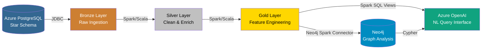

# Fraud Detection — Data Architecture Demo

A complete fraud detection pipeline showcasing **Data Architecture**, **Azure**, **Databricks (Scala)**, **Neo4j**, **PostgreSQL**, and **Azure OpenAI** — wired together in a realistic medallion-architecture system.

## Architecture



## Technology Stack

| Technology | Role | Justification |
|-----------|------|---------------|
| **Azure PostgreSQL** | Source OLTP database | ACID compliance, relational integrity, star schema for structured fraud data |
| **Azure Databricks** | ETL processing engine | Unified analytics, native Scala/Spark, Delta Lake, medallion architecture |
| **Neo4j** | Graph analysis | Relationship traversal for fraud ring detection, pattern matching, network centrality |
| **Azure OpenAI** | Natural language interface | GPT-4o generates SQL/Cypher from plain English questions |
| **Terraform** | Infrastructure as Code | Reproducible, version-controlled Azure provisioning |
| **Delta Lake** | Storage format | ACID transactions, time travel, schema enforcement across medallion layers |

## Project Structure

```
├── infra/                          # Terraform IaC
│   ├── versions.tf                 # Provider versions
│   ├── variables.tf                # Input variables
│   ├── outputs.tf                  # Connection strings & endpoints
│   ├── resource-group.tf           # Azure resource group
│   ├── postgresql.tf               # Azure PostgreSQL Flexible Server
│   ├── databricks.tf               # Azure Databricks workspace
│   ├── databricks-config.tf        # Databricks cluster, notebooks, secret scope + library
│   ├── openai.tf                   # Azure OpenAI + GPT-4o deployment
│   ├── keyvault.tf                 # Azure Key Vault + secret storage
│   ├── neo4j.tf                    # Neo4j on Azure Container Instance
│   └── scripts/
│       ├── _common.ps1             # Shared PowerShell helpers
│       ├── deploy.ps1              # Provision all Azure resources
│       ├── destroy.ps1             # Tear down with safety confirmation
│       ├── push-notebooks.ps1      # Upload notebooks via Databricks REST API
│       └── status.ps1              # Health check of provisioned resources
├── sql/
│   ├── ddl/create_tables.sql       # PostgreSQL star schema DDL
│   └── seed/generate_data.py       # Sample data with 5 fraud patterns
├── databricks/notebooks/
│   ├── 01-bronze-ingestion.scala   # Raw JDBC ingestion to Delta
│   ├── 02-silver-transformation.scala  # Cleaning, validation, enrichment
│   ├── 03-gold-aggregation.scala   # Feature engineering
│   ├── 04-neo4j-export.scala       # Graph database loading
│   └── 05-ai-query-interface.scala # NL query via Azure OpenAI
├── neo4j/
│   ├── docker-compose.yml          # Local Neo4j (alternative to ACI)
│   ├── setup/constraints.cypher    # Indexes and constraints
│   └── queries/fraud-patterns.cypher  # 8 fraud detection queries
├── ai/prompts/
│   └── system_prompt.md            # Schema-aware prompt for GPT-4o
└── docs/
    ├── architecture.md             # Detailed architecture with Mermaid diagrams
    ├── data-models.md              # PostgreSQL & Neo4j data models
    ├── design-decisions.md         # Technology choice rationale
    └── demo-walkthrough.md         # Step-by-step demo script
```

## Quick Start

### Prerequisites

- [Terraform](https://www.terraform.io/downloads) >= 1.9.0
- [Azure CLI](https://learn.microsoft.com/en-us/cli/azure/install-azure-cli) (logged in)
- [PowerShell 7+](https://github.com/PowerShell/PowerShell) (`pwsh`)
- [Docker Desktop](https://www.docker.com/products/docker-desktop) (for Neo4j)
- [Python 3.10+](https://www.python.org/) with `psycopg` and `faker`

### 1. Provision Azure Infrastructure

```powershell
cd infra
pwsh scripts/deploy.ps1
```

This creates: Resource Group, PostgreSQL Flexible Server, Databricks Workspace (with Key-Vault-backed secret scope, auto-terminating compute cluster, and all five pipeline notebooks), Azure OpenAI + GPT-4o, Key Vault with all pipeline secrets, Neo4j on Azure Container Instance.

### 2. Load PostgreSQL Schema & Sample Data

```powershell
pip install psycopg faker
python sql/seed/generate_data.py
```

Generates ~10K transactions across 500 customers, 200 merchants, and 1,000 accounts with 6 embedded fraud patterns.

### 3. Run Databricks Notebooks

Notebooks are deployed to `/FraudDetection/` in the workspace automatically by Terraform. Run them in order:

1. **01-bronze-ingestion** — Reads PostgreSQL via JDBC, writes Delta tables
2. **02-silver-transformation** — Cleans, validates, enriches data
3. **03-gold-aggregation** — Engineers fraud detection features
4. **04-neo4j-export** — Loads graph into Neo4j
5. **05-ai-query-interface** — Natural language queries via GPT-4o

### 4. Neo4j

Neo4j is deployed as an Azure Container Instance automatically by Terraform. Access the browser at the URL from Terraform outputs:

```powershell
cd infra
terraform output neo4j_browser_url
```

Credentials: `neo4j` / `fraud-demo-2026`. The Bolt URL is automatically stored in Key Vault for Databricks.

Alternatively, for local development, use the Docker Compose file:

```powershell
cd neo4j
docker compose up -d
```

Run the fraud detection queries from `neo4j/queries/fraud-patterns.cypher`.

### 6. Tear Down

```powershell
cd infra
pwsh scripts/destroy.ps1
docker compose -f neo4j/docker-compose.yml down -v
```

## Fraud Patterns (Seeded)

| Pattern | Description | Detection Method |
|---------|-------------|------------------|
| **Circular Rings** | A→B→C→A money flow | Neo4j path traversal |
| **Velocity Spikes** | Many transactions in short windows | Gold layer time-window aggregations |
| **Structuring** | Amounts just below reporting thresholds | Statistical analysis on amount distributions |
| **New Account Exploitation** | High-value transactions on new accounts | Account age vs. transaction volume features |
| **Cross-Border Laundering** | International transfers between high-risk countries | Graph cross-border edge analysis |
| **High-Velocity Pairs** | Unusually frequent transactions between same accounts | Graph relationship property analysis |

## Cost Estimate

| Resource | SKU | Estimated Monthly Cost |
|----------|-----|----------------------|
| PostgreSQL Flexible Server | B_Standard_B1ms | ~£12 |
| Databricks Workspace | Premium (pay-per-use) | ~£5–20 (demo usage) |
| Azure OpenAI (GPT-4o) | GlobalStandard | ~£1–5 (per-token) |
| Neo4j (ACI) | 2 vCPU / 4 GB | ~£30 |
| Key Vault | Standard | ~£0 (< 10K ops) |
| **Total** | | **< £70/month** |

> **Important:** Run `pwsh infra/scripts/destroy.ps1` when finished to stop billing.

## Blog Series

This project is documented in a three-part Medium series:

- [Part 1: Architecture & Infrastructure](blog/part-1-architecture-and-infrastructure.md) — Architecture decisions, data models, and Terraform IaC
- [Part 2: Data Pipeline](blog/part-2-data-pipeline.md) — Medallion layers, feature engineering, and Neo4j loading
- [Part 3: Graph Analysis & AI](blog/part-3-graph-analysis-and-ai.md) — Fraud detection queries and the natural language interface

## Licence

This project is a demonstration portfolio piece. No licence is granted for commercial use.
