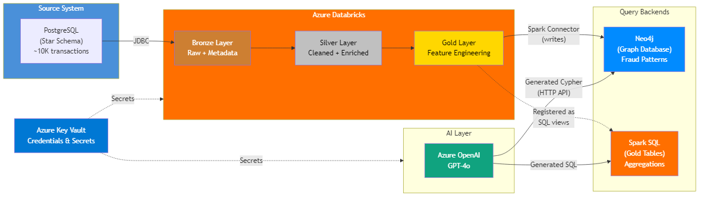
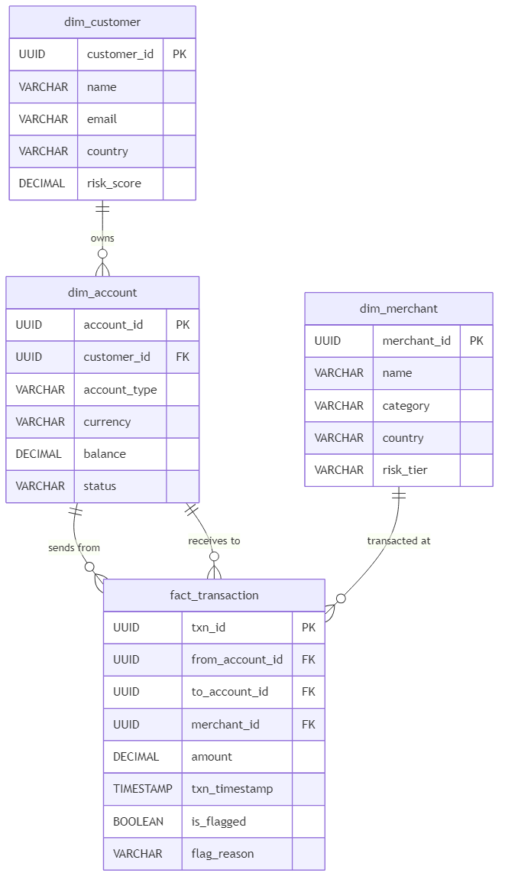
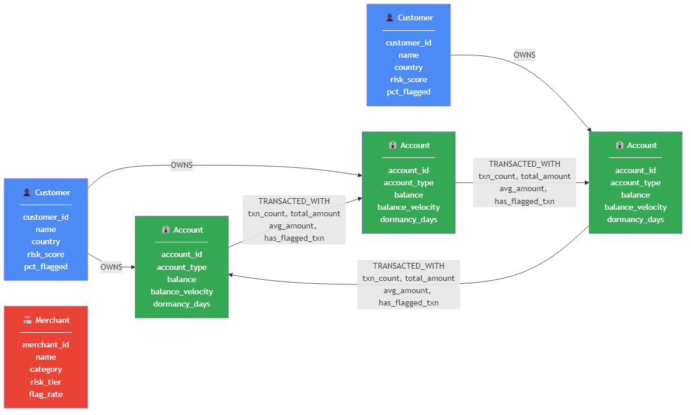
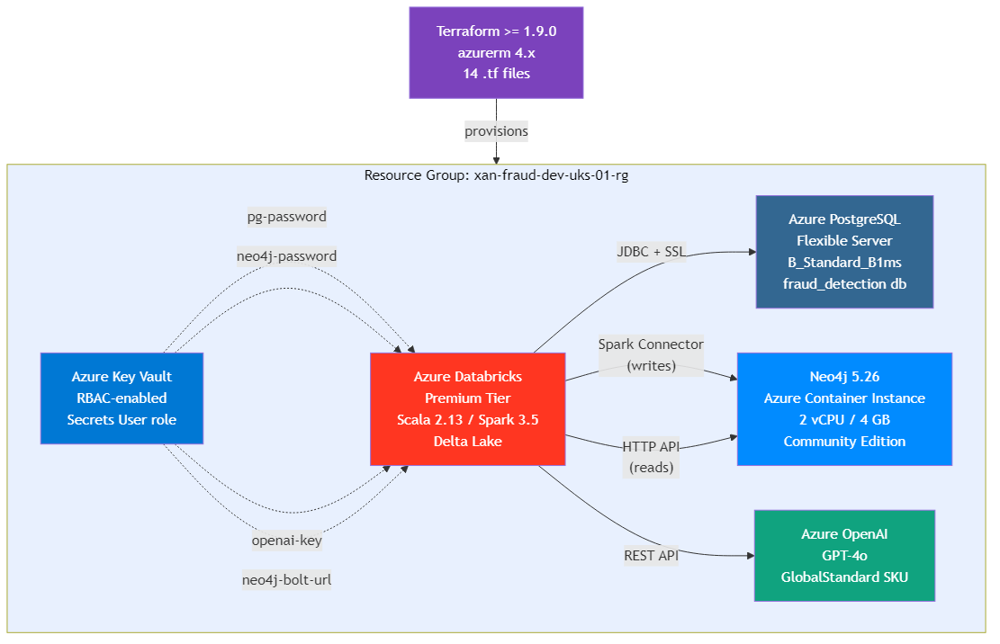

# Building a Fraud Detection Platform on Azure — Part 1: Architecture & Infrastructure

*Part 1 of 3 — [Part 2: Data Pipeline →](part-2-data-pipeline.md) | [Part 3: Graph Analysis & AI →](part-3-graph-analysis-and-ai.md)*

---

I wanted to prove I could design and build a production-grade fraud detection platform from scratch — relational, graph, and AI — deployed to a single Azure resource group, fully automated with Terraform, and torn down with one command when I'm done.

This isn't a tutorial that stops at "here's a diagram." Every line of infrastructure, every notebook, every query runs. The full code is on [GitHub](https://github.com/byronbayer/fraud-detection-azure-demo) — clone it, deploy it, run it, destroy it.

In this first post, I'll walk through the architecture decisions, the data model design, and the Terraform infrastructure that makes it all reproducible.

---

## Why This Project

I built this as a portfolio piece for data architecture contract roles. The brief I set myself was simple: demonstrate hands-on experience across **six technologies** in a single, cohesive system — not six isolated "hello world" demos.

The technologies aren't arbitrary. Each one earns its place:

- **PostgreSQL** — the transactional source system
- **Databricks (Scala/Spark)** — the ETL engine
- **Neo4j** — the graph database for relationship analysis
- **Azure OpenAI (GPT-4o)** — the natural language query interface
- **Terraform** — infrastructure as code
- **Delta Lake** — the storage format across medallion layers

Fraud detection is the ideal domain because it genuinely *needs* all of them. Relational databases handle structured transaction data well, but they're terrible at finding circular money flows across five accounts. Graph databases handle that beautifully, but they're not where you want to run aggregations over millions of rows. And neither of them helps a compliance officer who just wants to ask "which customers have the highest fraud rate?" in plain English.

---

## The Architecture


*End-to-end data flow: PostgreSQL → Databricks medallion → Neo4j + Azure OpenAI*

The system follows a fairly standard modern data architecture pattern, with one twist — it routes queries to *two* different backends depending on what you're asking.

**PostgreSQL** acts as the source OLTP system, holding a star schema with ~10,000 financial transactions across 500 customers, 200 merchants, and ~1,000 accounts. Five deliberate fraud patterns are embedded in the seed data (more on that in Part 2).

**Databricks** ingests everything via JDBC and processes it through three **medallion layers**:
- **Bronze** — raw copy with metadata
- **Silver** — cleaned, deduplicated, enriched
- **Gold** — aggregated features ready for analysis and graph loading

**Neo4j** receives nodes and relationships from the gold layer via the Neo4j Spark Connector. Once loaded, Cypher queries detect circular money flows, money mules, and cross-border anomalies — patterns that would require expensive recursive CTEs in SQL.

**Azure OpenAI (GPT-4o)** sits on top of both backends. You ask a question in English; GPT-4o classifies it, generates either SQL or Cypher, and the notebook executes it against the right backend. "Show me the top 10 customers by fraud rate" goes to Spark SQL. "Find circular transaction patterns" goes to Neo4j.

**Azure Key Vault** holds every credential — PostgreSQL passwords, Neo4j auth, OpenAI API keys, even the data paths. Nothing is hardcoded in notebooks.

---

## Technology Choices — Why These Six

I want to be explicit about *why* each technology, because "I used it because it's popular" isn't a design decision.

### PostgreSQL: Structured Integrity at the Source

Financial transactions demand ACID compliance. The star schema — `dim_customer`, `dim_merchant`, `dim_account`, and `fact_transaction` — provides strong data governance with foreign keys and CHECK constraints. Azure's burstable B1ms SKU costs ~£12/month, which is ideal for a demo that needs to persist data without burning cash.

I considered Cosmos DB, but a document model doesn't suit a structured star schema. Azure SQL would work but costs more and locks you into SQL Server syntax.

### Databricks + Scala: Type-Safe Distributed Processing

Scala is Spark's native language. Using it demonstrates deeper platform fluency than PySpark alone — you get compile-time type safety, and the code reads closer to how Spark actually works under the hood. Delta Lake adds ACID transactions, schema enforcement, and time travel to the data lake.

The Premium tier is required for Key Vault-backed secret scopes, which is how notebooks access credentials without hardcoding them.

### Neo4j: Relationships as First-Class Citizens

Here's the key insight: in a relational database, relationships are *computed at query time* via joins. In a graph database, relationships are *stored directly*. Finding a circular money flow — A sends to B, B sends to C, C sends back to A — is a constant-time traversal in Neo4j, regardless of how many accounts exist. In PostgreSQL, it's a recursive CTE that grows exponentially with depth.

Cypher makes this readable too:

```cypher
MATCH path = (a1:Account)-[:TRANSACTED_WITH]->(a2:Account)
             -[:TRANSACTED_WITH]->(a3:Account)
             -[:TRANSACTED_WITH]->(a1)
RETURN a1.account_id, a2.account_id, a3.account_id
```

Try expressing that in SQL. You'll end up with three self-joins and a `WHERE` clause that's longer than the Cypher query.

### Azure OpenAI (GPT-4o): Democratising Data Access

The AI layer isn't a gimmick — it solves a real problem. Fraud analysts and compliance officers shouldn't need to learn SQL *and* Cypher to query the system. GPT-4o, grounded with schema context and few-shot examples, generates the right query for the right backend. Temperature is set to 0.1 for deterministic output, and write operations are explicitly prohibited in the system prompt.

### Terraform: One Command to Build, One to Destroy

Every Azure resource is defined in Terraform. `deploy.ps1` runs `terraform init → plan → apply` and captures all outputs. `destroy.ps1` tears everything down. No portal click-ops, no orphaned resources, no surprise bills.

---

## The Data Models

This project uses two complementary data models — a relational star schema and a property graph — because fraud detection genuinely requires both perspectives.

### PostgreSQL Star Schema


*Star schema: fact_transaction at the centre, three dimension tables around it*

The schema is deliberately simple — four tables, clear relationships:

| Table | Rows | Purpose |
|-------|------|---------|
| `dim_customer` | 500 | Customer attributes + risk score |
| `dim_merchant` | 200 | Merchant details + risk tier |
| `dim_account` | ~1,000 | Accounts owned by customers (1–3 each) |
| `fact_transaction` | ~10,000 | Financial transactions with fraud flags |

Key design choices:
- **UUIDs** for all primary keys — avoids sequential ID leakage
- **`is_flagged` + `flag_reason`** on transactions — enables filtering without a separate flags table
- **Partial index** on `is_flagged WHERE is_flagged = true` — only ~2.5% of transactions are flagged, so a partial index is far smaller than a full one
- **Separate `from_account_id` and `to_account_id`** — supports P2P transfers *and* merchant payments (where `to_account_id` is null)

The full DDL is in [`sql/ddl/create_tables.sql`](https://github.com/byronbayer/fraud-detection-azure-demo/blob/main/sql/ddl/create_tables.sql).

### Neo4j Property Graph


*Property graph: Customer, Account, and Merchant nodes connected by OWNS and TRANSACTED_WITH relationships*

The graph model transforms the star schema into something relationship-native:

- **Customer** nodes carry aggregated features: `risk_score`, `pct_flagged`, `total_txn_count`
- **Account** nodes carry behavioural metrics: `balance_velocity`, `dormancy_days`, `night_txn_pct`
- **Merchant** nodes carry risk signals: `flag_rate`, `category`, `risk_tier`
- **OWNS** relationships connect customers to their accounts
- **TRANSACTED_WITH** relationships connect accounts to accounts, carrying edge properties: `txn_count`, `total_amount`, `avg_amount`, `has_flagged_txn`

The `TRANSACTED_WITH` edges are the gold — they're what enable circular ring detection, money mule identification, and cross-border cluster analysis. These are pre-aggregated from the gold layer's `gold_transaction_pairs` table, so each edge represents an entire P2P transfer history between two accounts.

Uniqueness constraints and composite indexes are defined in [`neo4j/setup/constraints.cypher`](https://github.com/byronbayer/fraud-detection-azure-demo/blob/main/neo4j/setup/constraints.cypher).

---

## Infrastructure as Code


*All five Azure services in a single resource group, provisioned by Terraform*

The infrastructure is split across 14 Terraform files, each with a single responsibility:

```
infra/
├── versions.tf          # Terraform + provider versions
├── main.tf              # Documentation only — no resources
├── variables.tf         # 23 input variables
├── locals.tf            # Common tags, naming prefix (single source of truth)
├── data.tf              # Current client config + Databricks SP lookup
├── naming.tf            # Azure naming + locations modules
├── outputs.tf           # 19 outputs (FQDNs, URLs, keys)
├── resource-group.tf    # Single resource group
├── postgresql.tf        # Flexible Server + database + firewall
├── databricks.tf        # Premium workspace
├── databricks-config.tf # Cluster, notebooks, secret scope + library
├── openai.tf            # Cognitive Services + GPT-4o deployment
├── keyvault.tf          # Key Vault + RBAC role assignments + 14 secrets
└── neo4j.tf             # ACI container running Neo4j 5.26
```

### Naming Convention

I've [written before](https://medium.com/@byronbayer/stop-naming-your-azure-resources-like-its-2010-5dbde06099d8) about why prefixing Azure resources with the infrastructure type — `rg-`, `kv-`, `st-` — is a mistake. It scatters related components across the Azure Portal alphabetically by *what they are* rather than *what they belong to*. After years of seeing this pattern trip up teams on client engagements, I use a suffix-based convention that puts resource type last.

The naming convention I have gone with is: `[Owner]-[Workload]-[Environment]-[Region]-[Instance]-[ResourceType]`.

The prefix components are defined once in `locals.tf` as a list — a single source of truth that feeds both the naming module and any custom resource names:

```hcl
locals {
  name_prefix = [
    var.owner,                       # xan
    var.workload,                    # fraud
    var.environment,                 # dev
    module.locations.short_name,     # uks
    var.instance                     # 01
  ]
}
```

The naming module simply consumes this list:

```hcl
module "naming" {
  source  = "Azure/naming/azurerm"
  version = ">= 0.4.0"
  prefix  = local.name_prefix
}
```

This gives names like `xan-fraud-dev-uks-01-psql`, `xan-fraud-dev-uks-01-kv` — immediately readable, sortable, and predictable. All resources for the same workload group together in the portal. No random strings.

One warning: **changing a naming convention after deployment destroys every resource.** Azure resource names are immutable. Terraform treats a name change as destroy-and-recreate. I accepted the full rebuild for a demo project, but in production, you'd need `moved` blocks or `terraform state mv` to avoid data loss. Lock your naming convention down at inception.

### Key Vault as the Secrets Hub

Key Vault is the centre of the security model. Every credential — PostgreSQL connection strings, Neo4j passwords, OpenAI API keys, even the Delta Lake paths — is stored as a Key Vault secret and injected by Terraform:

```hcl
resource "azurerm_key_vault" "main" {
  name                      = module.naming.key_vault.name
  sku_name                  = "standard"
  purge_protection_enabled  = false  # allow clean destroy for demo
  enable_rbac_authorization = true
}

# Deployer: full secret access (read/write/delete)
resource "azurerm_role_assignment" "deployer_secrets" {
  scope                = azurerm_key_vault.main.id
  role_definition_name = "Key Vault Secrets Officer"
  principal_id         = data.azurerm_client_config.current.object_id
}

# Databricks SP: read-only secret access
resource "azurerm_role_assignment" "databricks_secrets" {
  scope                = azurerm_key_vault.main.id
  role_definition_name = "Key Vault Secrets User"
  principal_id         = data.azuread_service_principal.databricks.object_id
}
```

RBAC is the modern approach — access policies are the legacy model. With RBAC, permissions are managed via Azure role assignments rather than embedded in the vault resource, which means they're auditable, consistent with how you secure every other Azure resource, and don't hit the 1,024 access policy limit on a single vault.

That Databricks role assignment is critical and easy to miss. The Databricks first-party service principal (`2ff814a6-3304-4ab8-85cb-cd0e6f879c1d`) needs `Key Vault Secrets User` for Key Vault-backed secret scopes to work. Without it, `dbutils.secrets.get()` silently returns empty strings — no error, just blank values. I spent a frustrating hour debugging notebooks that "should have worked" before realising the SP didn't have access.

### Neo4j on Azure Container Instance

Neo4j runs as an ACI container rather than a VM or managed service. For a demo, it's the simplest option — Terraform provisions it directly:

```hcl
resource "azurerm_container_group" "neo4j" {
  name            = "${join("-", local.name_prefix)}-neo4j"
  os_type         = "Linux"
  ip_address_type = "Public"

  container {
    image  = "neo4j:5.26-community"
    cpu    = 2
    memory = 4

    environment_variables = {
      NEO4J_server_bolt_listen__address     = "0.0.0.0:7687"
      NEO4J_server_http_listen__address     = "0.0.0.0:7474"
      NEO4J_server_bolt_advertised__address = ":7687"
      NEO4J_server_http_advertised__address = ":7474"
    }
  }
}
```

Notice those environment variable names: `NEO4J_server_*`, not `NEO4J_dbms_*`. Neo4j 5.x moved all connector settings from the `dbms.*` namespace to `server.*`. If you use the old names, the container silently crashes within 8 seconds — no logs, no error message, just `ExitCode 1`. I debugged this by progressively stripping configuration until I found the minimal failing set. Always check your environment variable names against the specific major version of the image.

---

## Cost Breakdown

One of the first questions people ask is "how much will this cost me?" Here's the honest breakdown:

| Service | SKU | Monthly Cost |
|---------|-----|-------------|
| PostgreSQL Flexible Server | B_Standard_B1ms | ~£12 |
| Databricks Premium | Pay-per-DBU | ~£5–20 |
| Azure OpenAI | S0 + GPT-4o | ~£1–5 |
| Neo4j (ACI) | 2 vCPU / 4 GB | ~£30 |
| Key Vault | Standard | ~£0 |
| **Total** | | **~£50–70** |

The ACI cost is the biggest driver. In a real project, you'd stop the container when not in use. The Databricks cost depends on cluster hours — the auto-terminating cluster shuts down after 10 minutes of inactivity.

Run `terraform destroy` when you're done and billing stops immediately.

---

## Getting Started

### Prerequisites

- Azure subscription with Contributor access
- [Terraform >= 1.9.0](https://developer.hashicorp.com/terraform/downloads)
- [PowerShell 7+](https://learn.microsoft.com/en-us/powershell/scripting/install/installing-powershell) (`pwsh`)
- [Azure CLI](https://learn.microsoft.com/en-us/cli/azure/install-azure-cli) (logged in via `az login`)

### Deploy

```powershell
git clone https://github.com/byronbayer/fraud-detection-azure-demo.git
cd fraud-detection-azure-demo

# Provision all Azure resources
pwsh infra/scripts/deploy.ps1
```

The script handles everything: `terraform init`, `plan`, `apply`, and captures outputs into a `.env` file for downstream scripts. It'll prompt you for your Azure subscription ID and PostgreSQL admin password.

Terraform provisions the Databricks workspace *and* configures it — the Key-Vault-backed secret scope, an auto-terminating compute cluster (with the Neo4j Spark Connector pre-installed), and all five pipeline notebooks are created in a single `terraform apply`.

After deployment, you'll need to seed PostgreSQL with sample data before running the pipeline — we cover that at the start of [Part 2](part-2-data-pipeline.md).

### Tear Down

```powershell
pwsh infra/scripts/destroy.ps1
```

Type the resource group name to confirm, or use `-Force` to skip the prompt. All 26 resources are destroyed and billing stops.

---

## What's Next

In **[Part 2](part-2-data-pipeline.md)**, we build the data pipeline — ingesting from PostgreSQL, cleaning and enriching through three medallion layers, engineering the features that make fraud patterns visible, and loading everything into Neo4j.

---

*The complete source code is available on [GitHub](https://github.com/byronbayer/fraud-detection-azure-demo). If you found this useful, follow me for Parts 2 and 3.*
