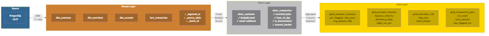

# Building a Fraud Detection Platform on Azure — Part 2: The Data Pipeline

*Part 2 of 3 — [← Part 1: Architecture & Infrastructure](part-1-architecture-and-infrastructure.md) | [Part 3: Graph Analysis & AI →](part-3-graph-analysis-and-ai.md)*

---

In [Part 1](part-1-architecture-and-infrastructure.md) we built the Azure infrastructure — PostgreSQL, Databricks, Neo4j, OpenAI, Key Vault — all wired up with Terraform. Now we fill it with data and push it through the medallion pipeline: Bronze, Silver, Gold, and out into Neo4j.

This is where the architecture earns its keep. By the end of this post, you'll have ~10,000 transactions processed through three increasingly refined layers, with pre-computed fraud features loaded into a graph database ready for pattern detection.

---

## Seeding the Source System

Before the pipeline has anything to process, PostgreSQL needs data. The seed script ([`sql/seed/generate_data.py`](https://github.com/byronbayer/fraud-detection-azure-demo/blob/main/sql/seed/generate_data.py)) uses Faker and some careful randomisation to generate:

- **500 customers** across 8 countries
- **200 merchants** across 10 categories (15% in high-risk countries)
- **~1,000 accounts** (1–3 per customer)
- **~10,000 transactions** — 9,000 normal, plus six deliberate fraud patterns

Those six patterns are the whole point of the seed data. If everything were random, there'd be nothing to detect:

| Pattern | What It Does | How It Works |
|---------|-------------|--------------|
| **Circular rings** | A→B→C→A money flow | Selects 3 accounts, creates transactions forming a cycle |
| **Velocity spikes** | >10 transactions from one account in <1 hour | Bursts of rapid-fire transfers from a single source |
| **Structuring** | Amounts just below £10,000 | Classic smurfing — breaking large sums into sub-threshold chunks |
| **New-account exploitation** | High-value transactions within 48 hours of opening | Tests whether the system flags suspicious early activity |
| **Cross-border anomalies** | Domestic customer → high-risk country merchant | Unexpected geographic transaction patterns |
| **High-velocity pairs** | 5–15 repeated transfers between the same account pair | Surfaces concentrated account-to-account churn that can indicate mule routing |

Each pattern flags the relevant transactions with `is_flagged = true` and a `flag_reason` explaining the pattern. This means we know ground truth — we can validate that the pipeline and graph queries actually surface the right patterns.

```powershell
pip install psycopg[binary] faker

# Get the password from Key Vault
$pw = az keyvault secret show --vault-name "xan-fraud-dev-uks-01-kv" `
  --name "pg-password" --query value -o tsv

# Seed the database
python sql/seed/generate_data.py `
  --host "xan-fraud-dev-uks-01-psql.postgres.database.azure.com" `
  --password $pw
```

The script creates the schema tables (if they don't already exist via `sql/ddl/create_tables.sql`), generates deterministic sample data (seed=42) with the five fraud patterns above, and loads everything in a single transaction. It's idempotent — re-running it truncates and reloads.

**Firewall note:** The PostgreSQL Flexible Server has a firewall rule allowing only your deploying machine's public IP. If your IP has changed since deployment (VPN, ISP reassignment, different location), the seed script will hang on "Connecting to PostgreSQL..." and eventually time out. Update the firewall rule first:

```powershell
$currentIp = (Invoke-RestMethod -Uri "https://api.ipify.org")
az postgres flexible-server firewall-rule update `
  --resource-group xan-fraud-dev-uks-01-rg `
  --name xan-fraud-dev-uks-01-psql `
  --rule-name AllowClientIP `
  --start-ip-address $currentIp `
  --end-ip-address $currentIp
```

---

## The Medallion Architecture


*Three layers: each one transforms raw data into progressively more useful shapes*

The medallion pattern — Bronze, Silver, Gold — isn't just about having three folders. Each layer has a specific contract:

- **Bronze** = raw copy with audit metadata, schema preserved exactly as source
- **Silver** = cleaned, deduplicated, validated, enriched with derived fields
- **Gold** = aggregated, feature-engineered, shaped for specific consumers

The important constraint is that **every layer is a Delta table**. That gives us ACID transactions, schema enforcement, and time travel across the entire pipeline. If a gold table looks wrong, you can query the silver version and trace back to exactly what the bronze ingestion pulled.

Let's walk through each layer.

---

## Bronze Layer — Raw Ingestion

The bronze notebook ([`databricks/notebooks/01-bronze-ingestion.scala`](https://github.com/byronbayer/fraud-detection-azure-demo/blob/main/databricks/notebooks/01-bronze-ingestion.scala)) does one thing: copy every table from PostgreSQL into Delta format, unchanged, with three metadata columns added for lineage tracking.

```scala
val batchId = java.util.UUID.randomUUID().toString
val ingestedAt = Instant.now().toString

def addIngestionMetadata(df: DataFrame, sourceTable: String): DataFrame = {
  df.withColumn("_ingested_at", lit(ingestedAt).cast("timestamp"))
    .withColumn("_source_table", lit(sourceTable))
    .withColumn("_batch_id", lit(batchId))
}
```

Every row gets a timestamp, a source table name, and a batch ID. This means you can always answer "when was this data ingested?" and "which batch does it belong to?" — essential for debugging and audit trails.

The ingestion itself is a simple JDBC read-and-write, wrapped in a reusable function:

```scala
def ingestTable(tableName: String): Long = {
  val df = spark.read.jdbc(jdbcUrl, tableName, connectionProperties)
  val enriched = addIngestionMetadata(df, tableName)
  
  enriched.write
    .format("delta")
    .mode("overwrite")
    .option("overwriteSchema", "true")
    .save(s"$bronzePath/bronze_$tableName")

  enriched.count()
}

val tables = Seq("dim_customer", "dim_merchant", "dim_account", "fact_transaction")
tables.foreach(ingestTable)
```

The `overwriteSchema` option is deliberate — if the source schema changes (new column, type change), the bronze layer adapts without manual intervention. This is a design choice that trades schema stability for ingestion reliability. In production, you might prefer `mergeSchema` for an additive-only approach.

**Configuration note:** All connection details come from Key Vault via Databricks' secret scope — `dbutils.secrets.get("fraud-detection", "pg-host")`. Nothing is hardcoded. The secret scope is provisioned automatically by Terraform (see `infra/databricks-config.tf`).

---

## Silver Layer — Clean, Validate, Enrich

The silver notebook ([`databricks/notebooks/02-silver-transformation.scala`](https://github.com/byronbayer/fraud-detection-azure-demo/blob/main/databricks/notebooks/02-silver-transformation.scala)) is where data quality enforcement happens. Each of the four source tables gets its own transformation with specific rules.

### Customer Cleaning

```scala
val silverCustomer = bronzeCustomer
  // Deduplicate: keep the most recently created record per email
  .withColumn("_row_num", row_number().over(
    Window.partitionBy("email").orderBy(col("created_at").desc)
  ))
  .filter(col("_row_num") === 1)
  .drop("_row_num")
  // Validate email format
  .filter(col("email").rlike("^[^@]+@[^@]+\\.[^@]+$"))
  // Normalise country codes to uppercase
  .withColumn("country", upper(trim(col("country"))))
  // Null checks
  .filter(col("name").isNotNull && col("email").isNotNull)
  // Clamp risk_score to 0–100
  .withColumn("risk_score", when(col("risk_score") < 0, lit(0.0))
    .when(col("risk_score") > 100, lit(100.0))
    .otherwise(col("risk_score")))
  // Drop bronze metadata
  .drop("_ingested_at", "_source_table", "_batch_id")
```

This is a representative example of the pattern used across all four tables. The key operations:

1. **Deduplication** — window function with `row_number()`, partitioned by the natural key, ordered by recency
2. **Validation** — regex for emails, enum checks for status/risk_tier, null guards
3. **Normalisation** — consistent casing, trimmed whitespace
4. **Clamping** — keeping values within valid bounds rather than dropping entire rows
5. **Metadata removal** — bronze audit columns don't belong in silver

### Transaction Enrichment

The transaction table gets the richest treatment — it's the fact table that drives most downstream analysis:

- **Dimension joins**: customer name and country from `silver_customer`, merchant category and risk tier from `silver_merchant` — denormalised into the silver transaction table for easier aggregation
- **Derived fields**: `txn_date` (date-only), `hour_of_day`, `day_of_week`, `is_international` (sender country ≠ merchant country), `amount_bucket` (ranges like <100, 100–500, 500–1000, etc.)
- **Structural validation**: amount > 0, valid currency codes, timestamp within reasonable range

The silver layer roughly doubles the column count of each table — those derived columns save repeated computation in the gold layer and any ad-hoc analysis.

---

## Gold Layer — Feature Engineering

The gold notebook ([`databricks/notebooks/03-gold-aggregation.scala`](https://github.com/byronbayer/fraud-detection-azure-demo/blob/main/databricks/notebooks/03-gold-aggregation.scala)) produces four feature tables, each designed for a specific consumer.

### Gold Customer Features

This is where the fraud signal starts to emerge. For each customer, we compute:

```scala
val goldCustomerFeatures = custTxns
  .groupBy("customer_id")
  .agg(
    // Volume across time windows
    count("txn_id").as("total_txn_count"),
    count(when(col("txn_timestamp") > date_sub(refTimestamp, 1), col("txn_id")))
      .as("txn_count_24h"),
    count(when(col("txn_timestamp") > date_sub(refTimestamp, 7), col("txn_id")))
      .as("txn_count_7d"),
    count(when(col("txn_timestamp") > date_sub(refTimestamp, 30), col("txn_id")))
      .as("txn_count_30d"),

    // Amount statistics
    round(avg("amount"), 2).as("avg_amount"),
    round(stddev("amount"), 2).as("stddev_amount"),
    round(max("amount"), 2).as("max_single_txn"),

    // Risk indicators
    count(when(col("is_flagged") === true, col("txn_id"))).as("flagged_count"),
    round(
      count(when(col("is_flagged") === true, col("txn_id"))).cast("double") /
      count("txn_id").cast("double") * 100, 2
    ).as("pct_flagged"),

    // Behavioural
    countDistinct("merchant_id").as("unique_merchants_total"),
    count(when(col("is_international") === true, col("txn_id")))
      .as("international_txn_count"),
    round(avg("hour_of_day"), 1).as("avg_txn_hour")
  )
```

Multiple time windows (24h, 7d, 30d) are critical. A customer with 50 transactions over a year is normal. A customer with 50 transactions in 24 hours is almost certainly suspicious. The `pct_flagged` column directly measures fraud signal, while `stddev_amount` catches accounts with erratic spending patterns.

### Gold Account Features

Per-account metrics focus on balance behaviour and temporal patterns:

- **Balance velocity** — how fast does the balance change? High velocity on a dormant account is a red flag
- **Dormancy days** — days since last transaction. Suddenly active dormant accounts are suspicious
- **Night transaction percentage** — transactions between 22:00 and 06:00 as a proportion. Fraud operations often favour off-hours
- **Daily volume statistics** — average daily amount and count, for establishing baselines

### Gold Transaction Pairs

This table is the most interesting from a graph perspective. It aggregates all P2P transfers between every pair of accounts:

```
from_account_id | to_account_id | txn_count | total_amount | avg_amount | has_flagged_txn | first_txn | last_txn
```

Each row becomes a `TRANSACTED_WITH` relationship in Neo4j. The `has_flagged_txn` flag is carried as an edge property so graph queries can immediately filter for suspicious connections without joining back to transaction data.

### Gold Merchant Risk

Per-merchant fraud metrics: total transactions, flagged transactions, flag rate, unique customer count. The `risk_tier` from the dimension table is carried forward, but now augmented with actual behavioural data. A merchant categorised as "low" risk with a 15% flag rate needs investigation.

---

## Neo4j Export — From Tables to Graph

The export notebook ([`databricks/notebooks/04-neo4j-export.scala`](https://github.com/byronbayer/fraud-detection-azure-demo/blob/main/databricks/notebooks/04-neo4j-export.scala)) reads gold tables and writes them to Neo4j as nodes and relationships using the Neo4j Spark Connector.

This is where things got interesting — and by "interesting" I mean I hit three gotchas that cost me a combined half-day.

### Gotcha 1: DecimalType Is Not Supported

The Neo4j Spark Connector cannot serialise Spark's `DecimalType`. Gold layer aggregations (`avg_amount_30d`, `pct_flagged`, etc.) produce `DecimalType` by default. The error message is clear enough — `Unable to convert org.apache.spark.sql.types.Decimal to Neo4j Value` — but the fix needs to be comprehensive.

I wrote a helper that casts *all* Decimal columns to Double in one pass:

```scala
def decimalsToDoubles(df: DataFrame): DataFrame = {
  df.schema.fields.foldLeft(df) { (acc, f) =>
    f.dataType match {
      case _: DecimalType =>
        acc.withColumn(s"`${f.name}`", col(s"`${f.name}`").cast("double"))
      case _ => acc
    }
  }
}
```

Applied before every write: `neo4jOpts(decimalsToDoubles(customerNodes).write)`.

### Gotcha 2: Dots in Column Names

Notice the backticks in the function above? That's not decorative. Spark interprets `col("rel.total_amount")` as "the `total_amount` field inside a struct column called `rel`" — not a flat column literally named `rel.total_amount`. Wrapping in backticks forces Spark to treat it as a literal identifier:

```scala
col(s"`${f.name}`")  // treats the name as a literal, dots and all
```

This is the kind of bug that gives you a `UNRESOLVED_COLUMN.WITH_SUGGESTION` error pointing at a column that clearly exists. The suggestion — "Did you mean `rel`?" — is Spark helpfully confirming that it's parsing the dot as a struct dereference.

**Update:** We originally used `.as("rel.txn_count")` aliases for relationship columns, expecting the Neo4j Spark Connector to strip the `rel.` prefix. It doesn't — the connector stores column names verbatim as property names. The properties ended up named `rel.txn_count` in Neo4j, which broke our Cypher queries. The fix was simply dropping the `rel.` prefix entirely (see Lesson 17 in lessons-learnt). The backtick-escaping in `decimalsToDoubles` remains correct practice, but relationship columns no longer contain dots.

### Gotcha 3: Databricks Cannot Reach Localhost

My first attempt ran Neo4j in Docker on my laptop and pointed the Databricks notebook at `bolt://localhost:7687`. Predictably, this failed — Databricks clusters run in Azure, not on my machine.

The fix was deploying Neo4j as an Azure Container Instance (covered in Part 1's Terraform section). The Bolt endpoint becomes `bolt://<aci-fqdn>:7687`, which Databricks can reach over the public internet.

### The Export Process

With those gotchas resolved, the export follows a consistent pattern for each entity:

1. Read the gold Delta table
2. Select the columns needed for the node/relationship
3. Cast Decimals to Doubles
4. Write via the Neo4j Spark Connector with appropriate labels, keys, and constraints

```scala
neo4jOpts(decimalsToDoubles(customerNodes).write)
  .option("labels", ":Customer")
  .option("node.keys", "customer_id")
  .option("schema.optimization.type", "NODE_CONSTRAINTS")
  .mode("overwrite")
  .save()
```

Five write operations in total: Customer nodes, Account nodes, Merchant nodes, OWNS relationships (Customer→Account), and TRANSACTED_WITH relationships (Account→Account). The connector handles upserts, and node writes use `NODE_CONSTRAINTS` for schema optimisation.

---

## Running the Pipeline

With infrastructure deployed (Part 1), the sequence is:

```
1. Seed PostgreSQL        → python sql/seed/generate_data.py
2. Run notebooks 01–04    → in order, via Databricks workspace UI
```

The secret scope, compute cluster, and notebooks are all deployed by `terraform apply` — no separate scripts needed.

Each notebook validates its own output — it prints row counts and verifies that downstream data is non-empty before writing. If notebook 02 fails, you don't need to re-run 01; Delta tables are immutable snapshots, so the bronze data is still there.

### Verifying the Pipeline

After notebook 04 completes, open Neo4j Browser at `http://<aci-fqdn>:7474` and run:

```cypher
MATCH (n) RETURN labels(n)[0] AS label, count(n) AS count ORDER BY label;
```

You should see ~500 Customer nodes, ~1,000 Account nodes, ~200 Merchant nodes, and the corresponding relationships. If the counts look right, the pipeline is healthy and we're ready for the fun part — querying the graph for fraud patterns.

---

## What's Next

In **[Part 3](part-3-graph-analysis-and-ai.md)**, we put the graph to work — running Cypher queries that detect circular money flows, money mules, and cross-border anomalies. Then we wire up Azure OpenAI so anyone can query the system in plain English.

---

*The complete source code is available on [GitHub](https://github.com/byronbayer/fraud-detection-azure-demo). If you found this useful, follow me for Part 3.*
