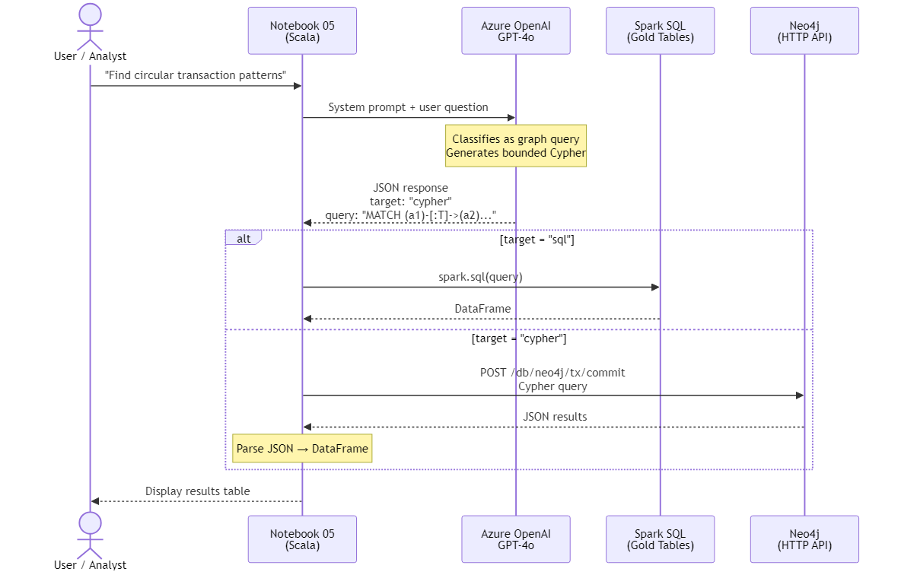

# Building a Fraud Detection Platform on Azure — Part 3: Graph Analysis & AI Query Interface

*Part 3 of 3 — [← Part 1: Architecture & Infrastructure](part-1-architecture-and-infrastructure.md) | [← Part 2: Data Pipeline](part-2-data-pipeline.md)*

---

In [Part 1](part-1-architecture-and-infrastructure.md) we built the infrastructure. In [Part 2](part-2-data-pipeline.md) we processed 10,000 transactions through the medallion pipeline and loaded them into Neo4j. Now we put the graph to work.

This final post covers two things: running Cypher queries that detect fraud patterns no SQL query could reasonably find, and then wiring up Azure OpenAI so anyone can query both the graph and the gold tables in plain English.

---

## Why Graph Queries Change Everything

I made the case in Part 1 that graph databases store relationships directly rather than computing them at query time. Let me make that concrete.

Suppose you want to find circular money flows — A sends money to B, B sends to C, C sends back to A. This is a classic money laundering pattern. In SQL, you'd write:

```sql
SELECT a1.account_id, a2.account_id, a3.account_id
FROM   transactions t1
JOIN   transactions t2 ON t1.to_account_id = t2.from_account_id
JOIN   transactions t3 ON t2.to_account_id = t3.from_account_id
WHERE  t3.to_account_id = t1.from_account_id
  AND  a1.account_id < a2.account_id
  AND  a2.account_id < a3.account_id;
```

That's three self-joins on the fact table for depth-3 rings. For depth-4, you add another join. For depth-5, another. Each additional depth multiplies the computational cost. On a table with millions of rows, this becomes prohibitively expensive.

In Cypher:

```cypher
MATCH path = (a1:Account)-[:TRANSACTED_WITH]->(a2:Account)
             -[:TRANSACTED_WITH]->(a3:Account)
             -[:TRANSACTED_WITH]->(a1)
WHERE a1.account_id < a2.account_id
  AND a2.account_id < a3.account_id
RETURN DISTINCT
  a1.account_id AS node_1,
  a2.account_id AS node_2,
  a3.account_id AS node_3,
  reduce(s = 0.0, r IN relationships(path) | s + r.total_amount) AS ring_total_amount
ORDER BY ring_total_amount DESC
```

Same result, but the graph engine traverses pre-stored relationships rather than computing joins. Adding depth-4 is just one more arrow in the pattern: `-[:TRANSACTED_WITH]->(a4:Account)`. The performance characteristics are fundamentally different — graph traversal is bounded by the local neighbourhood size, not the total dataset.

---

## Seven Fraud Detection Queries

The Cypher query library ([`neo4j/queries/fraud-patterns.cypher`](https://github.com/byronbayer/fraud-detection-azure-demo/blob/main/neo4j/queries/fraud-patterns.cypher)) contains eight queries. Here are the seven that detect specific fraud patterns.

### 1. Circular Money Flow Detection

The canonical money laundering pattern — money flows in a ring and comes back to the origin. We check both depth-3 and depth-4 rings:

```cypher
MATCH path = (a1:Account)-[:TRANSACTED_WITH]->(a2:Account)
             -[:TRANSACTED_WITH]->(a3:Account)
             -[:TRANSACTED_WITH]->(a1)
WHERE a1.account_id < a2.account_id
  AND a2.account_id < a3.account_id
RETURN DISTINCT
  a1.account_id AS node_1,
  a2.account_id AS node_2,
  a3.account_id AS node_3,
  reduce(s = 0.0, r IN relationships(path) | s + r.total_amount) AS ring_total_amount,
  reduce(s = 0,   r IN relationships(path) | s + r.txn_count)    AS ring_txn_count
ORDER BY ring_total_amount DESC
```

The `WHERE` clause with `<` comparisons prevents the same ring from appearing multiple times (A→B→C→A is the same ring as B→C→A→B). The `reduce()` function sums edge properties across the path — total money flowing through the ring and how many transactions formed it.

If this returns results with your seed data, the pipeline is working correctly. The seed script deliberately creates circular patterns for exactly this validation.

### 2. High-Velocity Transaction Pairs

Account pairs with unusually high transaction counts — a sign of money mule activity or systematic layering:

```cypher
MATCH (a1:Account)-[r:TRANSACTED_WITH]->(a2:Account)
WHERE r.txn_count >= 5
RETURN a1.account_id AS from_account,
       a2.account_id AS to_account,
       r.txn_count, r.total_amount, r.avg_amount,
       r.has_flagged_txn AS has_flag
ORDER BY r.txn_count DESC
```

The threshold of 5 is deliberately low for a demo dataset. In production, you'd calibrate this against your actual transaction volume distribution.

### 3. Flagged Transaction Network

Starting from edges that carry the `has_flagged_txn` flag, expand outward to reveal the connected network:

```cypher
MATCH (a:Account)-[r:TRANSACTED_WITH]->(b:Account)
WHERE r.has_flagged_txn = 1
WITH a, b, r
OPTIONAL MATCH (c:Customer)-[:OWNS]->(a)
OPTIONAL MATCH (d:Customer)-[:OWNS]->(b)
RETURN c.name AS sender_customer, c.risk_score AS sender_risk,
       a.account_id AS from_account, b.account_id AS to_account,
       d.name AS receiver_customer, d.risk_score AS receiver_risk,
       r.total_amount, r.txn_count
ORDER BY r.total_amount DESC
```

This query demonstrates graph traversal's strength — following relationships from flagged edges to their owning customers in a single query. The `OPTIONAL MATCH` handles cases where the customer link might not exist.

### 4. Multi-Account Customers (Structuring Indicators)

Customers owning three or more accounts — a prerequisite for structuring, where funds are split across accounts to avoid thresholds:

```cypher
MATCH (c:Customer)-[:OWNS]->(a:Account)
WITH c, collect(a) AS accounts, count(a) AS acct_count
WHERE acct_count >= 3
RETURN c.customer_id, c.name, c.risk_score, c.pct_flagged,
       acct_count,
       [a IN accounts | a.account_id] AS account_ids
ORDER BY acct_count DESC, c.pct_flagged DESC
```

### 5. Money Mule Identification

Pass-through accounts — ones that both receive from *and* send to many distinct accounts. These are the intermediaries in layering schemes:

```cypher
MATCH (src:Account)-[:TRANSACTED_WITH]->(mule:Account)
      -[:TRANSACTED_WITH]->(dst:Account)
WITH mule,
     count(DISTINCT src) AS in_degree,
     count(DISTINCT dst) AS out_degree
WHERE in_degree >= 3 AND out_degree >= 3
OPTIONAL MATCH (c:Customer)-[:OWNS]->(mule)
RETURN mule.account_id AS mule_account, c.name AS owner_name,
       c.risk_score, in_degree, out_degree,
       mule.total_amount AS throughput,
       mule.balance_velocity AS velocity
ORDER BY in_degree + out_degree DESC
```

The combination of high in-degree *and* high out-degree is the key signal. An account that receives from many sources is a funnel. An account that sends to many destinations is a distributor. Both together? That's a mule.

### 6. Merchant Risk Hotspots

Highest-risk merchants by actual fraud flag rate — not the static `risk_tier` from the dimension table, but computed behavioural data:

```cypher
MATCH (m:Merchant)
WHERE m.flag_rate > 10.0
RETURN m.merchant_id, m.name, m.category, m.country,
       m.risk_tier, m.total_txns, m.flagged_txns,
       m.flag_rate AS flag_rate_pct, m.total_volume
ORDER BY m.flag_rate DESC
```

### 7. Cross-Border Transaction Clusters

Transactions where the sender and receiver are in different countries — higher risk for cross-border laundering:

```cypher
MATCH (c1:Customer)-[:OWNS]->(a1:Account)
      -[r:TRANSACTED_WITH]->(a2:Account)<-[:OWNS]-(c2:Customer)
WHERE c1.country <> c2.country
RETURN c1.name AS sender, c1.country AS sender_country,
       c2.name AS receiver, c2.country AS receiver_country,
       r.total_amount, r.txn_count, r.has_flagged_txn
ORDER BY r.total_amount DESC
```

This query traverses four hops in a single statement: Customer→Account→Account→Customer. In SQL, that's two joins through the transaction table plus two joins to the customer table. The Cypher version reads almost like prose.

---

## The AI Query Interface


*Natural language → GPT-4o classification → SQL or Cypher → results*

The final notebook ([`databricks/notebooks/05-ai-query-interface.scala`](https://github.com/byronbayer/fraud-detection-azure-demo/blob/main/databricks/notebooks/05-ai-query-interface.scala)) ties everything together. A user asks a question in plain English, and the system decides *which database to query* and *what query to run*.

### How It Works

The flow is straightforward:

1. **User asks a question** — "Find customers with the highest fraud rate" or "Show me circular money flows"
2. **GPT-4o classifies and generates** — the system prompt contains full schema context for both backends, rules, and few-shot examples. GPT-4o returns a JSON response:

```json
{
  "target": "sql",
  "query": "SELECT name, pct_flagged FROM gold_customer_features ORDER BY pct_flagged DESC LIMIT 10",
  "explanation": "Ranking customers by percentage of flagged transactions"
}
```

3. **The notebook routes and executes** — SQL goes to Spark SQL (gold tables registered as views), Cypher goes directly to Neo4j via its HTTP transaction API
4. **Results are displayed** in the notebook

### The System Prompt

The system prompt is where all the intelligence lives. It contains:

- **Full schema definitions** for all four gold tables and all Neo4j node/relationship types, including property names and types
- **Routing rules** — SQL for aggregations, rankings, filtering; Cypher for relationships, paths, patterns, networks
- **Safety constraints** — read-only queries only (no DELETE, DROP, CREATE, MERGE, SET, or REMOVE)
- **Graph query constraints** — "NEVER use variable-length path patterns like `[:TRANSACTED_WITH*]`" — they cause combinatorial explosion. Always use fixed-length explicit hops
- **Few-shot Cypher examples** — bounded queries for circular rings, money mules, high-velocity pairs, and cross-border flows — so GPT-4o learns efficient, bounded graph patterns
- **Few-shot examples** — so GPT-4o learns the expected JSON output format

The graph query constraints deserve explanation. Early iterations used the Neo4j Spark Connector for Cypher reads, but it wraps queries internally for schema inference and pagination — causing complex graph traversals to hang indefinitely. The solution was to replace it with direct calls to Neo4j's HTTP transaction API (`/db/neo4j/tx/commit`), which executes Cypher as-is. This also removed the LIMIT/SKIP restriction that the connector imposed.

### The Routing Logic

```scala
def executeQuery(response: QueryResponse): Unit = {
  response.target.toLowerCase match {
    case "sql" =>
      val df = spark.sql(response.query)
      df.show(20, truncate = false)

    case "cypher" =>
      // Direct HTTP call to Neo4j's transaction API
      val cypherBody = s"""{"statements":[{"statement":${escapeJson(response.query)}}]}"""
      val conn = new URL(neo4jHttpUrl).openConnection().asInstanceOf[HttpURLConnection]
      conn.setRequestMethod("POST")
      conn.setRequestProperty("Authorization", s"Basic $neo4jAuth")
      // ... POST, read JSON response, parse into DataFrame
      val namedDf = rows.select(
        columns.zipWithIndex.map { case (name, idx) =>
          col("row").getItem(idx).cast("string").as(name)
        }: _*
      )
      namedDf.show(20, truncate = false)
  }
}
```

The elegance here is that both backends return Spark DataFrames. The Neo4j HTTP response is parsed into a DataFrame using Spark's JSON reader with `explode()` — so whether the data came from SQL or Cypher, the result format is identical. The user doesn't need to know — or care — which database answered their question.

> **Why not the Spark Connector for reads?** The Neo4j Spark Connector works perfectly for *writes* (notebook 04 uses it to load nodes and relationships). But for *reads*, it wraps user queries for schema inference and pagination. Complex graph traversals — the exact patterns fraud detection needs — hang indefinitely. The HTTP API executes Cypher as-is, returning results in under a second.

### Demo Queries

Some example questions and what happens:

| Question | Routed To | Why |
|----------|-----------|-----|
| "Which customers have the highest fraud rate?" | SQL | Aggregation over gold_customer_features |
| "Find circular transaction patterns" | Cypher | Graph traversal for ring detection |
| "Show me the riskiest merchants" | SQL | Ranking/filtering on gold_merchant_risk |
| "Which accounts act as intermediaries?" | Cypher | In-degree/out-degree analysis in the graph |
| "Compare transaction volumes across countries" | SQL | GROUP BY aggregation |

The key design decision is using GPT-4o with `temperature: 0.1` for near-deterministic output. We're not looking for creative writing — we want consistent, correct query generation. The `response_format: {"type": "json_object"}` constraint ensures the output is always valid JSON, not free text.

### No External SDK Required

One practical choice: the OpenAI client is a raw HTTP call, not an SDK import. Databricks clusters can be fiddly about library installation, and the Chat Completions API is just a POST request. The entire client is ~30 lines of standard `java.net.HttpURLConnection` code — zero external dependencies.

---

## Lessons Learnt — The Abridged Version

Over the course of building this project, I collected 20 distinct gotchas. The most impactful ones are woven through Parts 1 and 2, but here are a few more that didn't fit elsewhere:

**Terraform `-target` and PowerShell quoting.** `terraform apply -target=azurerm_container_group.neo4j` fails because PowerShell splits unquoted `-target=value` at spaces. Solution: wrap each target in single quotes.

**`scala.util.parsing.json.JSON` is deprecated.** The standard library JSON parser has been deprecated since Scala 1.0.6. I replaced it with regex-based field extraction — not elegant, but it has zero dependencies and works perfectly for the simple JSON structure GPT-4o returns.

**The `locations` module is easy to forget.** I declared the `azurerm/locations/azure` module but initially hardcoded `var.location` everywhere. If you declare a module, wire it in immediately — unused declarations are technical debt.

The full list of 20 lessons is in [`docs/lessons-learnt.md`](https://github.com/byronbayer/fraud-detection-azure-demo/blob/main/docs/lessons-learnt.md) in the repo. If you're building something similar, it's worth reading before you start — it'll save you the half-days I lost.

---

## Production Considerations

This is a demo, not a production system. If you were building this for real, you'd want to address:

**Security:**
- Neo4j behind a VNet with private endpoints, not a public ACI. The current setup exposes Bolt and HTTP to the internet
- Managed Identity instead of service principal for Databricks authentication
- Network security groups restricting PostgreSQL access to Databricks subnets only

**Scale:**
- Incremental ingestion (append/merge) instead of full overwrite at each medallion layer
- Streaming bronze layer via Kafka/Event Hubs for real-time fraud detection
- Neo4j Enterprise with the Graph Data Science library for community detection algorithms (GDS is Enterprise-only — Community Edition doesn't include it)
- Databricks Unity Catalog for data governance across workspaces

**Operations:**
- Databricks Jobs / Workflows for scheduled pipeline runs
- Alerting on gold layer metric thresholds (e.g., a merchant's flag rate suddenly doubling)
- Delta Lake time travel for audit compliance — "show me what the gold table looked like last Tuesday"
- CI/CD for notebook deployment and infrastructure changes

**Cost:**
- ACI stop/start automation — only run Neo4j when queries are needed
- Auto-terminating Databricks clusters (already configured, but review the timeout)
- Reserved capacity for PostgreSQL if running continuously

---

## Wrapping Up

Three posts, six technologies, one fraud detection platform. Here's what we covered:

- **Part 1:** Architecture decisions, star schema and graph data models, 14-file Terraform infrastructure, naming conventions, Key Vault integration, cost breakdown
- **Part 2:** Seed data with six fraud patterns, medallion pipeline (Bronze → Silver → Gold), Neo4j export with type compatibility gotchas
- **Part 3:** Seven Cypher fraud detection queries, dual-backend AI query interface, GPT-4o routing, production considerations

The whole thing deploys in ~15 minutes, runs on ~£50–70/month, and destroys cleanly with one command. Every component justifies its presence — there's no technology included just for the sake of variety.

Clone the [repo](https://github.com/byronbayer/fraud-detection-azure-demo), deploy it, break things, improve them. If you build something interesting on top of it, I'd genuinely like to hear about it.

---

*The complete source code is available on [GitHub](https://github.com/byronbayer/fraud-detection-azure-demo). Thanks for reading the series.*
