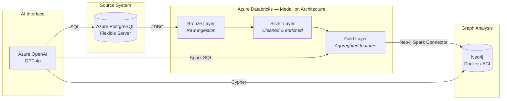
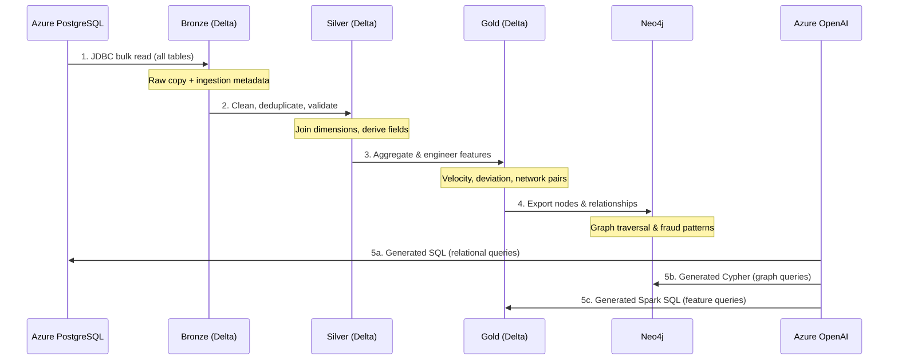
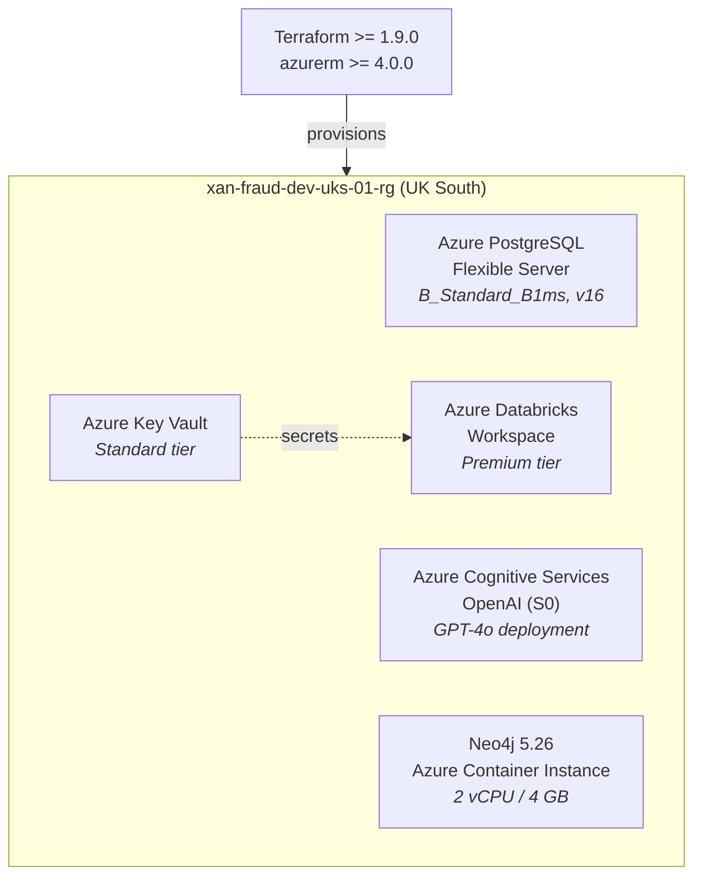

# Fraud Detection — Data Architecture

## Overview

This project demonstrates a full-stack data architecture for **financial transaction fraud detection**, integrating six technologies with distinct, complementary roles:

| Technology | Role | Justification |
|---|---|---|
| **Azure PostgreSQL** | Transactional source system | ACID-compliant relational store for normalised transaction data |
| **Azure Databricks (Scala/Spark)** | ETL & feature engineering | Distributed processing with medallion architecture on Delta Lake |
| **Neo4j** | Graph-based fraud analysis | Relationship traversal and pattern matching at scale |
| **Azure OpenAI (GPT-4o)** | Natural-language query interface | Democratises data access for non-technical stakeholders |
| **Terraform** | Infrastructure as Code | Reproducible, version-controlled cloud provisioning |
| Docker Compose | Local Neo4j (alternative) | Fast iteration without cloud dependency for graph layer |

## High-Level Architecture

## Data Flow

## Infrastructure Topology

All Azure resources reside in a single resource group provisioned by Terraform:

## Medallion Architecture Layers

| Layer | Storage | Purpose | Key Transformations |
|---|---|---|---|
| **Bronze** | Delta Lake | Raw ingestion | 1:1 copy from PostgreSQL; add `_ingested_at`, `_source_table`, `_batch_id` |
| **Silver** | Delta Lake | Cleaned & enriched | Null handling, deduplication, type validation; join dimensions to facts; derive `hour_of_day`, `day_of_week`, `is_international`, `amount_bucket` |
| **Gold** | Delta Lake | Feature engineering | Per-customer: `txn_count_24h`, `avg_amount_30d`, `unique_merchants_7d`; per-account: `balance_velocity`, `dormancy_days`; network: transaction pair preparation for graph loading |

## Technology Integration Points

| From → To | Mechanism | Configuration |
|---|---|---|
| PostgreSQL → Bronze | JDBC via Spark | `spark.read.format("jdbc")` with FQDN + SSL |
| Gold → Neo4j | Neo4j Spark Connector | `org.neo4j.spark:neo4j-connector-apache-spark_2.13:5.3.1_for_spark_3` |
| OpenAI → PostgreSQL | Generated SQL via Spark JDBC | Schema-aware prompt with few-shot examples |
| OpenAI → Neo4j | Generated Cypher via Neo4j HTTP API | Direct POST to `/db/neo4j/tx/commit`; results parsed into DataFrame |

## Security Considerations

- All connection strings, passwords, and API keys stored in Azure Key Vault
- Databricks accesses secrets via Key Vault-backed secret scope (no hardcoded credentials)
- Databricks first-party service principal granted Key Vault Secrets User role via RBAC
- Azure OpenAI access key retrieved from Key Vault at notebook runtime
- Neo4j deployed on ACI with credentials stored in Key Vault
- All Azure endpoints enforce TLS 1.2+
- PostgreSQL firewall restricts access to Azure services + operator IP

## Cost Estimate (Development)

| Resource | SKU | Estimated Monthly Cost |
|---|---|---|
| PostgreSQL Flexible Server | B_Standard_B1ms | ~£12 |
| Databricks | Pay-per-DBU (small cluster) | ~£5–20 (usage dependent) |
| Azure OpenAI | S0 (pay-per-token) | ~£1–5 (demo volume) |
| Neo4j (ACI) | 2 vCPU / 4 GB | ~£30 |
| Key Vault | Standard | ~£0 (< 10K ops) |
| **Total** | | **< £70/month** |

> **Note:** Run `terraform destroy` when not actively developing to avoid unnecessary charges.
