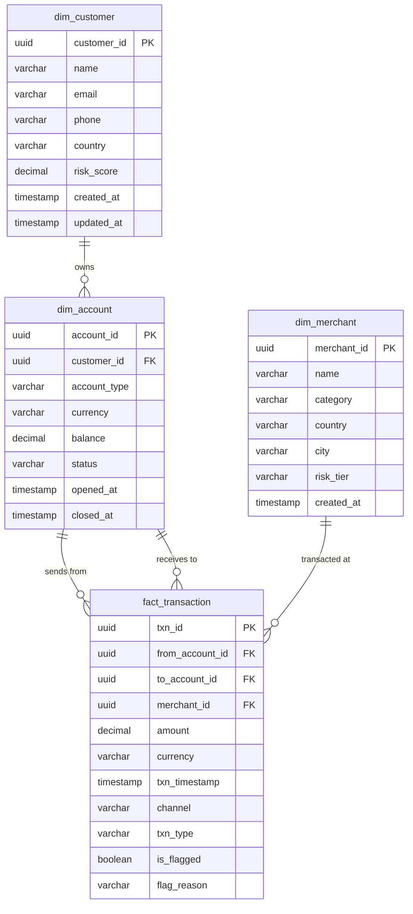
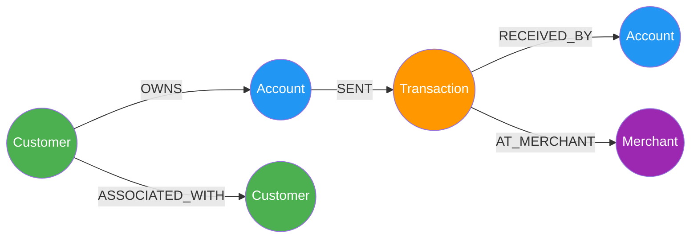
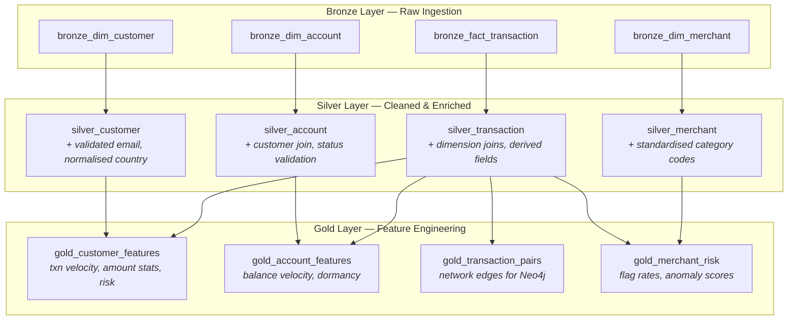

# Fraud Detection — Data Models

## 1. PostgreSQL Relational Model (Star Schema)

The source system uses a star schema optimised for analytical queries on financial transactions.

### Entity Relationship Diagram



### Table Details

#### `dim_customer`

| Column | Type | Constraints | Description |
|---|---|---|---|
| `customer_id` | `UUID` | PK, DEFAULT gen_random_uuid() | Unique customer identifier |
| `name` | `VARCHAR(200)` | NOT NULL | Full name |
| `email` | `VARCHAR(255)` | NOT NULL, UNIQUE | Email address |
| `phone` | `VARCHAR(20)` | | Phone number |
| `country` | `VARCHAR(3)` | NOT NULL | ISO 3166-1 alpha-3 country code |
| `risk_score` | `DECIMAL(5,2)` | DEFAULT 0.00 | Calculated risk score (0.00–100.00) |
| `created_at` | `TIMESTAMPTZ` | DEFAULT now() | Record creation timestamp |
| `updated_at` | `TIMESTAMPTZ` | DEFAULT now() | Last update timestamp |

#### `dim_merchant`

| Column | Type | Constraints | Description |
|---|---|---|---|
| `merchant_id` | `UUID` | PK, DEFAULT gen_random_uuid() | Unique merchant identifier |
| `name` | `VARCHAR(200)` | NOT NULL | Business name |
| `category` | `VARCHAR(50)` | NOT NULL | MCC category (e.g., retail, travel, gambling) |
| `country` | `VARCHAR(3)` | NOT NULL | ISO 3166-1 alpha-3 |
| `city` | `VARCHAR(100)` | | City name |
| `risk_tier` | `VARCHAR(10)` | NOT NULL, DEFAULT 'medium' | low / medium / high |
| `created_at` | `TIMESTAMPTZ` | DEFAULT now() | Record creation timestamp |

#### `dim_account`

| Column | Type | Constraints | Description |
|---|---|---|---|
| `account_id` | `UUID` | PK, DEFAULT gen_random_uuid() | Unique account identifier |
| `customer_id` | `UUID` | FK → dim_customer, NOT NULL | Owning customer |
| `account_type` | `VARCHAR(20)` | NOT NULL | current / savings / credit |
| `currency` | `VARCHAR(3)` | NOT NULL, DEFAULT 'GBP' | ISO 4217 currency code |
| `balance` | `DECIMAL(15,2)` | NOT NULL, DEFAULT 0.00 | Current balance |
| `status` | `VARCHAR(15)` | NOT NULL, DEFAULT 'active' | active / suspended / closed |
| `opened_at` | `TIMESTAMPTZ` | DEFAULT now() | Account opening date |
| `closed_at` | `TIMESTAMPTZ` | | Account closure date (nullable) |

#### `fact_transaction`

| Column | Type | Constraints | Description |
|---|---|---|---|
| `txn_id` | `UUID` | PK, DEFAULT gen_random_uuid() | Unique transaction identifier |
| `from_account_id` | `UUID` | FK → dim_account, NOT NULL | Originating account |
| `to_account_id` | `UUID` | FK → dim_account | Destination account (nullable for merchant payments) |
| `merchant_id` | `UUID` | FK → dim_merchant | Merchant (nullable for P2P transfers) |
| `amount` | `DECIMAL(15,2)` | NOT NULL, CHECK > 0 | Transaction amount |
| `currency` | `VARCHAR(3)` | NOT NULL, DEFAULT 'GBP' | Transaction currency |
| `txn_timestamp` | `TIMESTAMPTZ` | NOT NULL | When the transaction occurred |
| `channel` | `VARCHAR(20)` | NOT NULL | online / mobile / atm / branch / pos |
| `txn_type` | `VARCHAR(20)` | NOT NULL | payment / transfer / withdrawal / deposit |
| `is_flagged` | `BOOLEAN` | NOT NULL, DEFAULT false | Whether flagged as suspicious |
| `flag_reason` | `VARCHAR(100)` | | Reason for flag (nullable) |

### Indexes

```sql
-- Performance indexes for common fraud analysis queries
CREATE INDEX idx_fact_txn_timestamp ON fact_transaction (txn_timestamp DESC);
CREATE INDEX idx_fact_txn_from_account ON fact_transaction (from_account_id);
CREATE INDEX idx_fact_txn_to_account ON fact_transaction (to_account_id);
CREATE INDEX idx_fact_txn_merchant ON fact_transaction (merchant_id);
CREATE INDEX idx_fact_txn_flagged ON fact_transaction (is_flagged) WHERE is_flagged = true;
CREATE INDEX idx_dim_account_customer ON dim_account (customer_id);
CREATE INDEX idx_dim_customer_risk ON dim_customer (risk_score DESC);
```

---

## 2. Neo4j Property Graph Model

The graph model surfaces hidden relationships and patterns that are expensive to query in relational systems.

### Graph Schema



### Node Labels & Properties

#### `:Customer`

| Property | Type | Source |
|---|---|---|
| `customerId` | String (UUID) | dim_customer.customer_id |
| `name` | String | dim_customer.name |
| `country` | String | dim_customer.country |
| `riskScore` | Float | dim_customer.risk_score |
| `createdAt` | DateTime | dim_customer.created_at |

#### `:Account`

| Property | Type | Source |
|---|---|---|
| `accountId` | String (UUID) | dim_account.account_id |
| `accountType` | String | dim_account.account_type |
| `currency` | String | dim_account.currency |
| `balance` | Float | dim_account.balance |
| `status` | String | dim_account.status |

#### `:Transaction`

| Property | Type | Source |
|---|---|---|
| `txnId` | String (UUID) | fact_transaction.txn_id |
| `amount` | Float | fact_transaction.amount |
| `currency` | String | fact_transaction.currency |
| `timestamp` | DateTime | fact_transaction.txn_timestamp |
| `channel` | String | fact_transaction.channel |
| `txnType` | String | fact_transaction.txn_type |
| `isFlagged` | Boolean | fact_transaction.is_flagged |

#### `:Merchant`

| Property | Type | Source |
|---|---|---|
| `merchantId` | String (UUID) | dim_merchant.merchant_id |
| `name` | String | dim_merchant.name |
| `category` | String | dim_merchant.category |
| `riskTier` | String | dim_merchant.risk_tier |

### Relationship Types

| Relationship | From → To | Properties | Purpose |
|---|---|---|---|
| `OWNS` | Customer → Account | `since` (DateTime) | Ownership mapping |
| `SENT` | Account → Transaction | | Money outflow |
| `RECEIVED_BY` | Transaction → Account | | Money inflow |
| `AT_MERCHANT` | Transaction → Merchant | | Point-of-sale linkage |
| `ASSOCIATED_WITH` | Customer → Customer | `sharedAttribute` (String) | Shared phone, email domain, address, device |

### Constraints & Indexes

```cypher
-- Uniqueness constraints
CREATE CONSTRAINT customer_id IF NOT EXISTS FOR (c:Customer) REQUIRE c.customerId IS UNIQUE;
CREATE CONSTRAINT account_id IF NOT EXISTS FOR (a:Account) REQUIRE a.accountId IS UNIQUE;
CREATE CONSTRAINT txn_id IF NOT EXISTS FOR (t:Transaction) REQUIRE t.txnId IS UNIQUE;
CREATE CONSTRAINT merchant_id IF NOT EXISTS FOR (m:Merchant) REQUIRE m.merchantId IS UNIQUE;

-- Performance indexes
CREATE INDEX customer_country IF NOT EXISTS FOR (c:Customer) ON (c.country);
CREATE INDEX txn_timestamp IF NOT EXISTS FOR (t:Transaction) ON (t.timestamp);
CREATE INDEX txn_flagged IF NOT EXISTS FOR (t:Transaction) ON (t.isFlagged);
CREATE INDEX merchant_category IF NOT EXISTS FOR (m:Merchant) ON (m.category);
```

### Key Fraud Detection Query Patterns

| Pattern | Technique | Graph Advantage |
|---|---|---|
| **Circular money flow** | Variable-length path matching `(a)-[:SENT*3..6]->(a)` | Relational requires recursive CTEs — O(n³) |
| **Velocity anomaly** | Count relationships within time window per node | Graph indexes on timestamps + adjacency |
| **Shared-attribute clusters** | `ASSOCIATED_WITH` traversal + community detection | Natural representation of implicit networks |
| **Money mule identification** | Betweenness centrality on Account nodes | Native graph algorithm via GDS library |
| **Merchant collusion rings** | Bipartite projection: Merchant ↔ Account | Pattern matching on shared customer overlap |

---

## 3. Medallion Layer Mapping

### Bronze → Silver → Gold Transformation Chain



### Layer Detail

#### Bronze (Raw)

| Delta Table | Source | Added Metadata |
|---|---|---|
| `bronze_dim_customer` | dim_customer (PostgreSQL) | `_ingested_at`, `_source_table`, `_batch_id` |
| `bronze_dim_merchant` | dim_merchant (PostgreSQL) | `_ingested_at`, `_source_table`, `_batch_id` |
| `bronze_dim_account` | dim_account (PostgreSQL) | `_ingested_at`, `_source_table`, `_batch_id` |
| `bronze_fact_transaction` | fact_transaction (PostgreSQL) | `_ingested_at`, `_source_table`, `_batch_id` |

#### Silver (Cleaned)

| Delta Table | Transformations |
|---|---|
| `silver_customer` | Validate email format; normalise country codes to ISO 3166-1; deduplicate on email; null checks on required fields |
| `silver_merchant` | Standardise MCC categories; validate risk_tier enum; deduplicate on name + country |
| `silver_account` | Join customer name/country; validate status enum; filter closed accounts with null closed_at |
| `silver_transaction` | Join all dimensions; derive `hour_of_day`, `day_of_week`, `is_international` (cross-country), `amount_bucket` (micro/small/medium/large/xlarge); remove duplicates on txn_id; validate amount > 0 |

#### Gold (Features)

| Delta Table | Features | Downstream Use |
|---|---|---|
| `gold_customer_features` | `txn_count_24h`, `txn_count_7d`, `avg_amount_30d`, `stddev_amount_30d`, `unique_merchants_7d`, `max_single_txn`, `pct_flagged` | Risk scoring, OpenAI context |
| `gold_account_features` | `balance_velocity` (Δ balance / time), `dormancy_days` (days since last txn), `avg_daily_volume`, `peak_hour_pct` | Anomaly detection |
| `gold_transaction_pairs` | `from_account_id`, `to_account_id`, `total_amount`, `txn_count`, `first_txn`, `last_txn`, `avg_amount` | Neo4j relationship loading |
| `gold_merchant_risk` | `total_txns`, `flagged_txns`, `flag_rate`, `unique_customers`, `avg_txn_amount`, `stddev_txn_amount` | Merchant risk assessment |

---

## 4. Seeded Fraud Patterns

The sample data generator embeds deliberate fraud patterns for demonstration:

| Pattern | Description | Detection Method | Expected Count |
|---|---|---|---|
| **Circular rings** | A→B→C→A money flow completing a cycle | Neo4j variable-length path matching | 3–5 rings |
| **Velocity spikes** | > 10 transactions from one account within 1 hour | Gold layer `txn_count_24h` feature | 8–12 accounts |
| **Structuring** | Multiple transactions just below £10,000 reporting threshold | Silver layer `amount_bucket` + Gold aggregation | 5–8 customers |
| **New account exploitation** | High-value transactions within 48h of account opening | Join `dim_account.opened_at` with `fact_transaction.txn_timestamp` | 10–15 accounts |
| **Cross-border anomaly** | Customer in one country transacting with merchants in high-risk countries | Silver layer `is_international` flag | 15–20 transactions |
